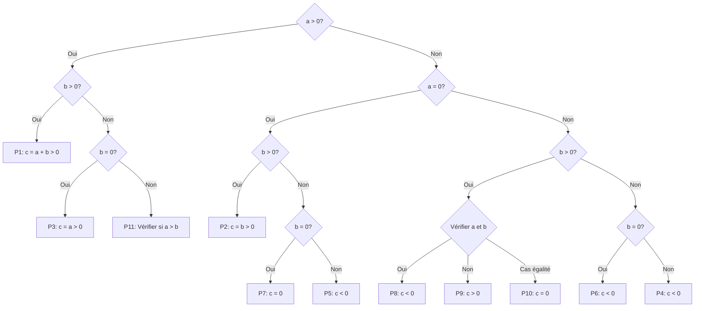
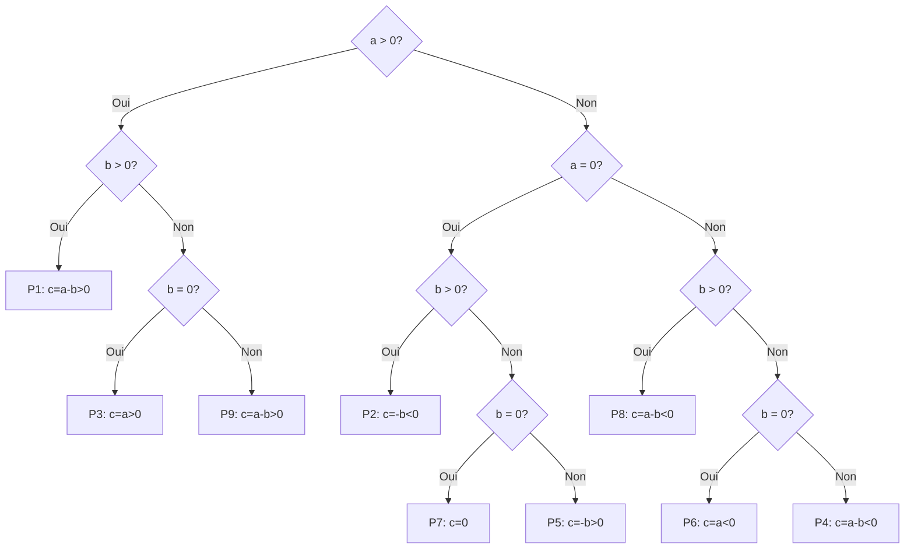
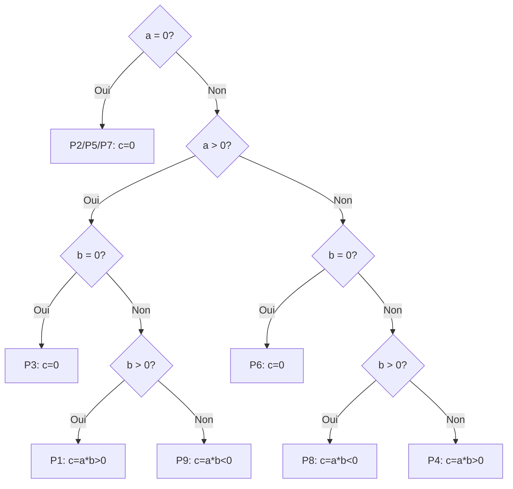
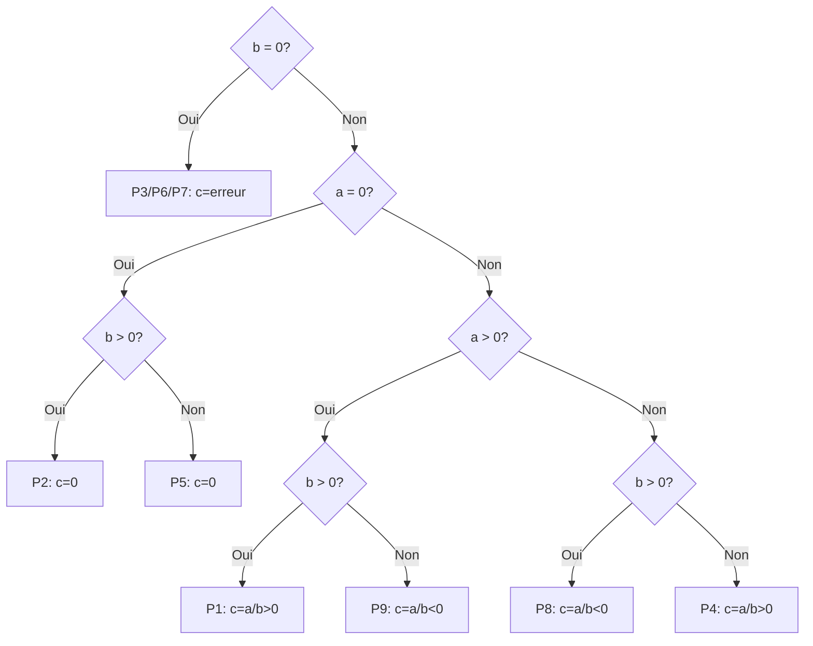

# Opération qui calcule l'addition de deux nombres entier relatifs a et b

| Classe  | a   | b               | résultat attendu  |
| ------- | --- | --------------- | ----------------- |
| P1      | a>0 | b>0             | c=a+b>0           |
| P2      | a=0 | b>0             | c=b>0             |
| P3      | a>0 | b=0             | c=a>0             |
| P4      | a<0 | b<0             | c=a+b<0           |
| P5      | a=0 | b<0             | c=b<0             |
| P6      | a<0 | b=0             | c=a<0             |
| P7      | a=0 | b=0             | c=0               |
| P8      | a<0 | b>0 et \|a\|>b  | c=a+b<0           |
| P9      | a<0 | b>0 et \|a\|<b  | c=a+b>0           |
| P10     | a<0 | b>0 et \|a\|=0  | c=a+b=0           |
| P11     | a>0 | b<0 et a>\|b\|  | c=a+b>0           |

# Opération qui calcule la soustraction de deux nombres entiers relatifs a et b

| Classe | a   | b   | résultat attendu  |
| ------ | --- | --- | ----------------- |
| P1     | a>0 | b>0 | c = a-b>0         |
| P2     | a=0 | b>0 | c = -b<0          |
| P3     | a>0 | b=0 | c = a>0           |
| P4     | a<0 | b<0 | c = a-b<0         |
| P5     | a=0 | b<0 | c = -b>0          |
| P6     | a<0 | b=0 | c = a<0           |
| P7     | a=0 | b=0 | c = 0             |
| P8     | a<0 | b>0 | c = a-b<0         |
| P9     | a>0 | b<0 | c = a-b>0         |

# Opération qui calcule la multiplication de deux nombres entiers relatifs a et b

| Classe | a   | b   | résultat attendu   |
| ------ | --- | --- | ------------------ |
| P1     | a>0 | b>0 | c = a\*b>0         |
| P2     | a=0 | b>0 | c = 0              |
| P3     | a>0 | b=0 | c = 0              |
| P4     | a<0 | b<0 | c = a\*b>0         |
| P5     | a=0 | b<0 | c = 0              |
| P6     | a<0 | b=0 | c = 0              |
| P7     | a=0 | b=0 | c = 0              |
| P8     | a<0 | b>0 | c = a\*b<0         |
| P9     | a>0 | b<0 | c = a\*b<0         |

# Opération qui calcule la division de deux nombres entiers relatifs a et b

| Classe | a   | b   | résultat attendu  |
| ------ | --- | --- | ----------------- |
| P1     | a>0 | b>0 | c = a/b>0         |
| P2     | a=0 | b>0 | c = 0             |
| P3     | a>0 | b=0 | c = erreur        |
| P4     | a<0 | b<0 | c = a/b>0         |
| P5     | a=0 | b<0 | c = 0             |
| P6     | a<0 | b=0 | c = erreur        |
| P7     | a=0 | b=0 | c = erreur        |
| P8     | a<0 | b>0 | c = a/b<0         |
| P9     | a>0 | b<0 | c = a/b<0         |

